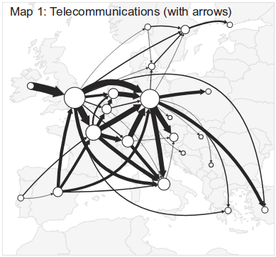

# Flow Map Curved Arrow Calculator - QGIS Plugin

This is a QGIS plugin which can be used to generate curved flow lines for use in creating an OD flow map, such as the
one seen below:

Source: Jenny et al (2016)

The plugin uses iterative force-based approach in which each flow is represented by a bezier curve. Each curve's
control point has various forces acting on it which cause it to be repelled from other nodes and curves, attracted 
to the straight-line midpoint, and to improve angular resolution at nodes. The algorithm is based on that described in
the paper [Force-directed layout of origin-destination flow maps](http://dx.doi.org/10.1080/13658816.2017.1307378)
by Jenny, et al.

This is a very computationally expensive operation, so it is only recommended for small- and medium-sized data sets.
Data sets up to approximately 20 flow lines should process in several minutes on most machines. A data set with 130 lines was
tested on the development machine, and processing took several hours. 

## Getting Started

### Prerequisites

QGIS >=2.0

The plugin has been tested on QGIS 2.18 on Linux and Windows.

### Installing

Copy files into a folder in your QGIS plugins directory and enable the plugin in the QGIS plugin manager.

## Contributing

Pull requests and bug reports are welcome.

## Authors

* **Patrick Malcolm** - *Initial work* - [patmalcolm91](https://github.com/patmalcolm91)

## See Also
* [Details of Good Flow Maps](https://anitagraser.com/2016/12/18/details-of-good-flow-maps/) - a good blog post about 
setting up flow map symbology in QGIS